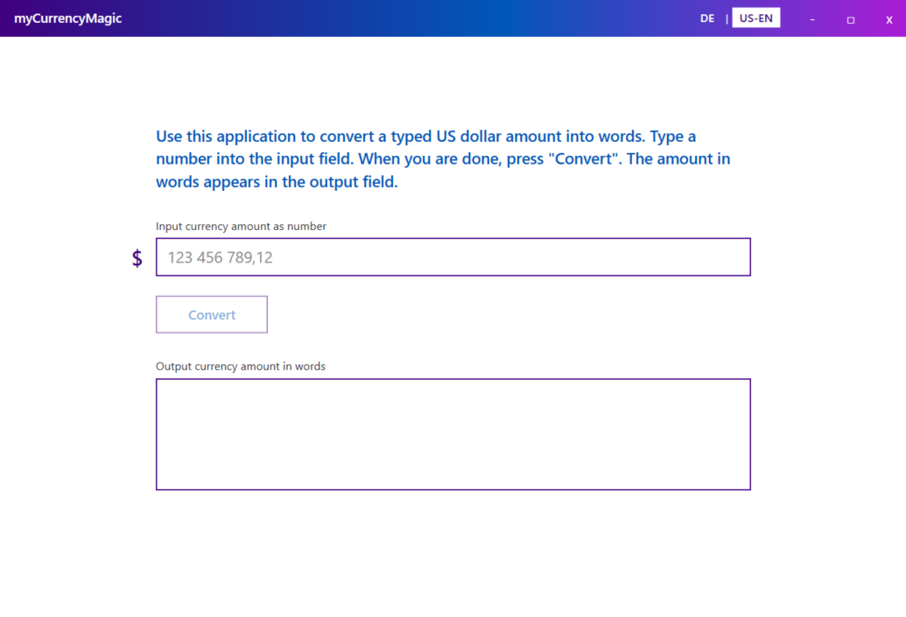

# myCurrencyMagic

<p align="center">
	
</p>

`myCurrencyMagic` is a .NET 9 WPF desktop client and local ASP.NET Core Minimal API server for converting numeric currency amounts in US Dollar into words.

The WPF client is the presentation layer. The server owns the conversion logic and is called through HTTP.


## Key Design Decisions & Assumptions

- **Currency:** US Dollar  
- **Supported languages:** German (DE) and US English (US-EN)  
- **Amount formatting:** If the amount contains a comma, both dollars and cents are always included in the output  
- **Internet usage:**  
  - Internet connection required once to download necessary packages for building the solution  
  - No internet connection required to run the application after the initial build  
- **Communication:** HTTP is used to avoid certificate-related complexities
  - http Client Header is used to fullfill a minimum of security
- **Architecture:** Localhost is used to fulfill the client–server architecture requirement  
- **Development settings:** “Hot Reload” feature disabled  
- **Testing:** FluentAssertions 8.10.0 used for unit tests (free of charge for non-commercial use only)  
- **Executables:** No standalone executables are provided for security reasons. Users can build executables themselves; see chapter [Go to build instructions](#build-and-run-standalone-executable) .


## Outlook

- Support for additional currencies and languages  
- Development of client-side logging  
- Extended exception handling (e.g., missing client headers)  
- Provision of remote server connectivity: URL, secure transport and access (HTTPS, authentication, firewall)  
- Linter integration for automated code quality checks  
- Development of a web client as an alternative to the desktop client  


## Solution Structure

```text
src/
  myCurrencyMagic.Client
  myCurrencyMagic.Server
  myCurrencyMagic.Shared
tests/
  myCurrencyMagic.UnitTests
  myCurrencyMagic.IntegrationTests
```

## Development Environment

### Prerequisites

- Windows with Visual Studio Community 2022.
- .NET 9 SDK.
- ASP.NET Core 9 runtime.
- .NET 9 Windows Desktop runtime.

The repository contains a root-level `global.json` that pins the SDK to:

```text
9.0.315
```

Verify the SDK from the repository root:

```powershell
dotnet --version
```

Expected:

```text
9.0.315
```

### Restore And Build From Command Line

Run from the repository root:

```powershell
dotnet restore .\myCurrencyMagic.sln
dotnet build .\myCurrencyMagic.sln --no-restore -m:1 -nr:false /p:UseSharedCompilation=false
```

The additional build flags avoid known WPF temporary-file locking issues in some local environments.

### Start From Command Line

Open two terminals from the repository root.

Terminal 1, start the server:

```powershell
dotnet run --project .\src\myCurrencyMagic.Server\myCurrencyMagic.Server.csproj --launch-profile http
```

The server listens on:

```text
http://localhost:5034
```

Terminal 2, start the WPF client:

```powershell
dotnet run --project .\src\myCurrencyMagic.Client\myCurrencyMagic.Client.csproj
```

The client calls the server endpoint:

```text
POST http://localhost:5034/convert
```

The client sends the required header:

```text
X-myCurrencyMagic-Client: myCurrencyMagic.Client
```

### Start In Visual Studio Community

1. Open `myCurrencyMagic.sln`.
2. Set the startup configuration to multiple startup projects.
3. Start `myCurrencyMagic.Server` and `myCurrencyMagic.Client`.
4. Use the `http` launch profile for the server.
5. Start debugging or start without debugging.

The client expects the server at:

```text
http://localhost:5034
```

If Visual Studio shows unwanted IIS-related prompts, use the server `http` profile and keep Hot Reload disabled for the server profile if preferred.

### Build and run standalone executable

Open a terminal and run the following command from the client root to build the client executable, and from the server root to build the server executable.

```powershell
dotnet publish -c Release -r win-x64 -p:PublishSingleFile=true -p:SelfContained=true
```

Start both created executables to run the application.


## Known Build Issue

If WPF build artifacts are locked, the command-line build can fail with access denied errors in generated files under `bin` or `obj`.

See `knownproblems.md` for the cleanup command and details.
